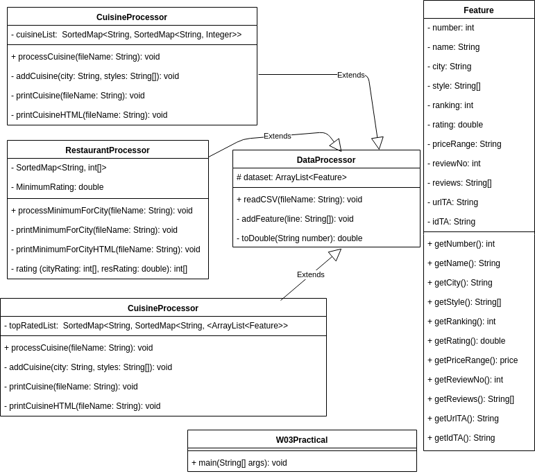
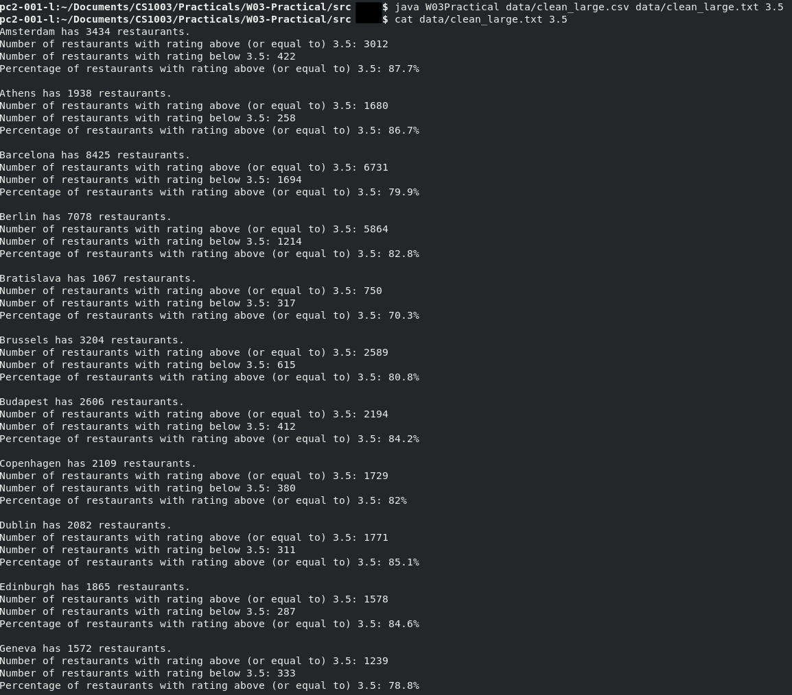
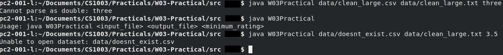
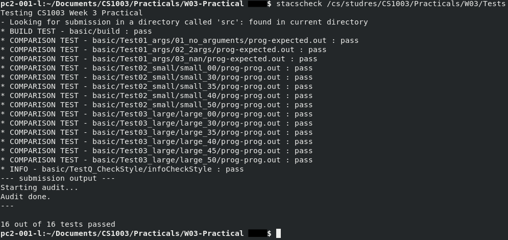

# W03 Practical Report

To access extension

```bash
git checkout Extension1
```

To access initial practical

```bash
git checkout master
```

## Overview

### Initial Specification

#### Requirements

* To process a data from a file
  * Read from a CSV file
  * Create and write to a new file
* The output file must contain:
  * Total number of restaurants for each city
  * Total number of restaurants that have a rating equal to or greater than minimum rating for each city
  * Total number of restaurants that have a rating less than minimum rating for each city
  * Percentage of restaurants that have a rating equal to or greater than minimum rating in each city
  * A summary at the end of the output file consisting of of the total umber of restaurants with a rating equal to or greater than and less than, minimum rating with percentage as well.
  * All numbers must be printed to 1 decimal place (`DecimalFormat` class may be used).

#### Deliverables

Program must run with command

```bash
java W03Practical <input_file> <output_file> <minimum_rating>
```

and if incorrect input is received program must the prompt in terminal

```bash
Usage: java W03Practical <input_file> <output_file> <minimum_rating>
```

The program must then be able to read all the data from the CSV file  and process it to be written to desired output file.

#### Problem Decomposition

* The program must separate all the fields by ","
* The program must be able to assign data types to fields co compare them with minimum rating
* The program able to sort the cities in alphabetical order while also gathering the information with relation to minimum rating.
* Output this formatted to file
* Detect errors in format of fields
* Detect errors in terminal input
* Detect errors in location of input file

## Extension

The extensions that have been attempted are as follows:

* Output
  * the number of restaurants in each city for each Cuisine Style
  * the name and rating of the best rated restaurants for each cuisine style in each city
* Make your output file into a web page.

### Assumption

That the clean dataset provided can be used for input of the extended program.

The 2 output extensions where separate in there execute by the program.

### Problem Decomposition

* Determined list of cities
* Determine list of cuisine for that city
* Determine number of cuisine

* Add tags to output to`.html` file
* consider the file extension used on the input of the program.

## Design

### Initial Specification


It was decided the final solution would be implemented in 3 classes. A class (`Feature`) was created to store each line of data. This was though as effective as it would help ensure data from the file is not changed during run time (by making them private and creating getters to limit their visibility) and allow for all the data in the file to be assigned proper data types. Problems that may arise from using this model is that if data is missing then empty space can not be converted to `int` or any other use case. Simple if statements can be used to ensure that this is factored for. This allows for an `ArrayList` with a specific type of `Feature` to store all the data in the dataset.

The `DataProcessor` was created with the intent to create a layer of abstraction upon the main class `W03Practical` and allow for the core elements of the task to be spilt into specific methods. e.g. reading the dataset, processing it to summarise on restaurants meeting the minimum rating, writing the process summaries to text file. The`ArrayList` type was used to store the dataset as I don't know how many line there are in the dataset and also this has be able to work on multiple variations of the initial dataset so to allow for this variable amount of elements an `ArrayList` was used. The `SortedMap<String, int[]>` was used to allow for all the keys of the map to be stored in alphabetical order and also to ensure cities are unique and allow for the storage of both number of restaurants which meet criteria and number of restaurants which don't. It was noted the the dataset contained missing data in ranking, rating and number of review fields. If there were tried to be converted to `int` or `double` eventually a runtime error would occur as an empty string would try to be converted to double. So a method was created to deal with this called `toDouble` it would convert the number to a double and if the string is empty give a automatic value of 0. It was noted that every field in the dataset had a number so this method was not required to be applied to it.

### Extension



It was decided to split the different processes the program into different classes and allow them to inherit from data processor the ability to read the file. This was done as then the `DataProcessor` class would be extremely long making class unreadable by others. So the `RestaurantProcessor` class is the initial practical broken away from the rest of the `DataProcessor` class.

The extension to the program makes heavy use of data structures. The `cusineList` makes use of the `SortedMap<String, Sortedmap<String, Integer>>` `. As the data has the following requirements:

* city must be unique
* we must be able to get the set of cuisines offered by city from just name of the city.
* we must not receive duplicated values of cuisine.
* We must be able to get the amount of restaurants which are offered by the cuisine in that city.
* must be able to get this list for the name of that cuisine.

This data structure allows for the prior conditions to be satisfied. The extension to the program also make use of the data structure `SortedMap<String, SortedMap<String, ArrayList<Feature>>>`. The requirements which necessitated the use of this data structure are:

* city must be unique
* we must be able to get the set of cuisines offered by the city from just the name of the city.
* We must receive duplicated values of cuisine.
* We must be able to get the top rated Restaurants. Since multiple restaurants can have the same rating then multiple restaurants can be at the top so some way of having multiple of them was required.

The data structure used was able to satisfy all these requirements.

#### Input into the Extension

The method of input into the extended program was decided as follows

The preceding input would return the cuisine styles a city offers and the number of restaurants which offer them as a text file.

```bash
java <input_file> <output_file> cusine
```

The preceding input would return the top rated restaurants for the cuisine styles offered in a city as a text file.

```bash
java <input_file> <output_file> rated
```

The preceding input would produce the initial practicals results.

```bash
java <input_file> <output_file> <minimum_rating>
```

So the execution of the initial practical is still in same style as initial.

To receive as webpage (`.html`) from the program all that is require is that you name your output file with `html` extension and the program will create the webpage. Meaning no addition input is required on the part of the user.

## Testing

### Initial Specification

#### Test case 1: Example of Running of Program

The purpose of this test is to show that the program is fully operational given expected input. The following command was use to run the program.

```bash
java W03Practical data/clean_large.csv data/clean_large.txt 3.5
```

##### Expected Result

It is expected that the program shall not show any errors and that a new file containing all the data summaries in alphabetical order shall be produced.

##### Actual Result




#### Test case 2: Testing Error Validation

The purpose of this test is to show that the program clearly gives error in case of incorrect input

1. incorrect `<minimum_rating>` format

   ```bash
   java W03Practical data/clean_large.csv data/clean_large.txt three
   ```

2. no command line input

   ```bash
   java W03Practical
   ```

3. non-existent dataset file referenced.

   ```bash
   java W03Practical data/doesnt_exist.csv data/clean_large.txt 3.5
   ```

   

##### Expected Results

1. "`Cannot parse as double: three`" error will be reported to terminal

2. "`Usage: java W03Practical <input_file> <output_file> <minimum_rating>`"
3. "`Unable to read dataset: doesnt_exist.csv`"

##### Actual Results



#### Stacscheck Output



### Extension

The program still contains same error checking as before so only the running of the processes were used as tests.

#### Test 1: Text Output

1. ```bash
   java W03Practical data/clean_small.csv data/minimum_small.txt 4.5
   ```

2. ```bash
   java W03Practical data/clean_small.csv data/cuisine_small.txt cuisine
   ```

3. ```java W03Practical dat
   java W03Practical data/clean_small.csv data/rated_small.txt rated
   ```

##### Expected Result

The correctly processed data for each process.

1. The same results as initial testing of initial specification
2. number of restaurants followed by each cuisine style
3. cuisine styles of cities followed by restaurants with high ratings

##### Actual Output

1. 


2.


3.


#### Test 2: HTML Output

1. ```bash
   java W03Practical data/clean_small.csv data/minimum_small.html 4.5
   ```

2. ```bash
   java W03Practical data/clean_small.csv data/cuisine_small.html cuisine
   ```

3. ```bash
   java W03Practical data/clean_small.csv data/rated_small.html rated
   ```

##### Expected Result

The correctly processed data for each process.

1. same as initial specification in html document format.
2. same as priot testing in html format
3. same as prior testing in html format

##### Actual Output

1. 

2.  

3. 

   

## Evaluation

### Initial Specification

The specification asked that a program which can parse a CSV dataset obtained from kaggle and that some process to produce a file which summarises cities of the restaurants which meet the minimum rating requirement. Through the testing of the program it was shown the program meets the requirements. Test case 1 showed that the program correctly  takes in required input in correct format and returns expected output in the form of a text file. Showing that the program successful parses the dataset and performs the desired processes. Through Test Case 2 it was shown that the program is able to handle errors in input of arguments into the program and report to the user the error that has occurred.

### Extension

The specification of extension requested following tasks:

* "Make your output file into a web page"
* Output:
  * the number of restaurants in each city for each Cuisine Style
  * the name and rating of the best rated restaurants for each cuisine style in each city


## Conclusion

In this practical a program was developed to allow for the reading and processing of information in a dataset in CSV format. 

Difficulties encountered during implementation were that string numbers which were in the format of "1.0", "5.0" were unable to be parsed directly to integers. To bypass this error they were first parsed to double then cast to integers. Another great difficulty was conforming to the desired "Kirby" style of coding specified by the stacscheck. It made writing simple code it to extreme tedious and time consuming process. When writing simple getters for variables in the feature class, since they were public it was required that java doc comments to be produced for all of them.

Given more time I would have allowed for my program to be able to read in the original dataset. An attempt to read in the dataset but there were too many inconsistencies in the dataset. Also another addition would be the displaying of processed data in a graphical format e.g. barchat. An attempt was made at this aswell but the program was able to be scale properly due to the amount of data to one screen. Another addition that could have been made was the output of data to `.json` or `.db ` formats.

# Extension Webpage Examples


